# RecruitFlow-Agents

This repository contains the backend AI agents for **RecruitFlow-Interviews** — a live, intelligent interview simulation platform designed to replicate realistic interview experiences using real-time WebRTC and LLM-driven agents.

---

## 🧠 Overview

RecruitFlow-Agents is the AI core behind the interview experience. It consists of multiple intelligent agents built using LangChain and LLM APIs (Gemini 2.0 Flash + GPT-4o), which simulate:

- Resume parsing
- Job description understanding
- Dynamic question generation
- Live audio conversation with the candidate

---

## 🧩 System Architecture

```mermaid
flowchart TD
    %% Backend Agents
    JD[1️⃣ JD Parser and Flow Generator]
    IA[2️⃣ Interview Agent - GPT-4o Realtime]
    RA[3️⃣ Report Agent - Transcript and PDF Generator]

    %% LiveKit in the middle
    LK[📡 LiveKit Room - WebRTC]

    %% Frontend at bottom
    A1[🧑‍💻 Candidate UI - Next.js]

    %% Data & Control Flow
    JD -->|Interview Plan| IA
    IA -->|Transcript and Logs| RA
    RA -->|PDF Report| A1

    %% WebRTC Connections
    IA -->|WebRTC| LK
    A1 -->|WebRTC| LK
```

## 🧑‍💻 Technologies Used

Python 3.10+

LangChain

Google Gemini 2.0 Flash API

OpenAI GPT-4o (streaming)

LiveKit Python SDK

Reportlab(Python) (for structured interview report generation)

React

NextJs

---
## 🧠 Agents Overview
**ResumeParserAgent**: Extracts candidate details and email from uploaded resumes.(PyPDF)

**JDInterpreterAgent**: Reads job description to understand context.Crafts dynamic questions based on role, JD, and resume.(Gemini-2.0-Flash)

**InterviewConductorAgent**: Connects via LiveKit and handles real-time interactions using GPT-4o.

**Result and Report**: Makes a detailed PDF Report of The Responces.

---

## 🔗 WebRTC Connection Flow (LiveKit Cloud)
Frontend initializes a new interview session via LiveKit API.

It shares room credentials (Room name, Token) with the backend via API or WebSocket.

The backend joins the same LiveKit room as a "virtual interviewer".

Backend listens to candidate's audio, streams responses via GPT-4o, and sends back audio in real-time.

---
# Connecting To the Client

*The Client side Frontend connects to this agent via WebRTC connection i.e. with LiveKit Cloud*
For the Frontend Client Please Visit my Repo:
[frontend](https://github.com/Muco0l/RecuritFlow_interview_Client.git)
---
## The Final Product You get is:

**i.e. a perfect tool to practice and tackel any interview**
